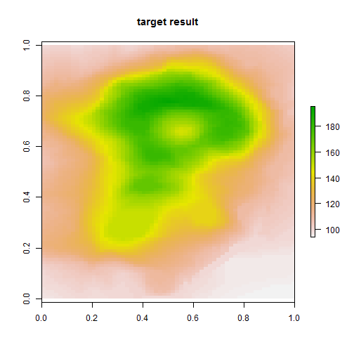
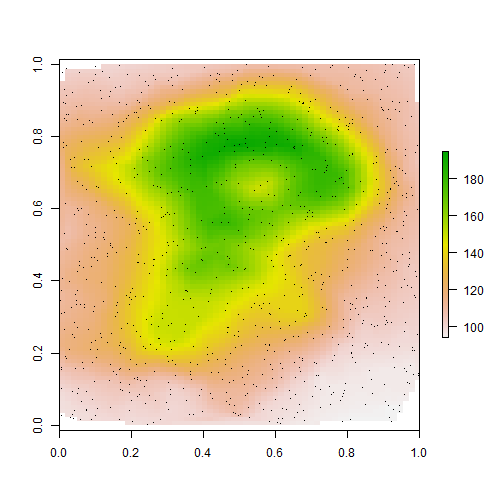
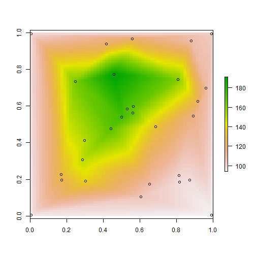

## Functions required


```r
#' Identify point-in-triangle by conversion to polygons
#'
#' @param tri list P n*2 coordinates and T matrix of n*3 indices defining triangles
#' @param pts 
#' @importFrom sp Polygon Polygons SpatialPolygons CRS proj4string over
tri_pip <- function(tri, pts) {
  ps <- lapply(split(tri$T, seq(nrow(tri$T))), function(x) Polygon(tri$P[c(x, x[1]), ]))
  sp <- lapply(seq_along(ps), function(x) Polygons(ps[x], x))
  spp <- SpatialPolygons(sp, proj4string = CRS(proj4string(pts)))
  over(pts, spp)
}

#' Triangulate and fit to a grid. 
#'
#' @param xy xy points
#' @param value covariate at points (e.g. elevation)
#' @importFrom sp coordinates SpatialPoints
#' @importFrom RTriangle triangulate pslg
#' @importFrom geometry cart2bary
#' @importFrom raster raster extent setValues
trifun <- function(xy, value, grid = NULL, ...) {
   if (is.null(grid)) grid <- raster(extent(xy))
  #tri <- geometry::delaunayn(xy); 
  #tri <- rgl::triangulate(xy)
  #tri <- deldir::deldir(xy)
 tri <- RTriangle::triangulate(pslg(P = xy))
  rxy <- coordinates(grid)

  ## triangle id for every point
  pid <- tri_pip(tri, SpatialPoints(rxy))
  ok <- !is.na(pid)

  ## estimated value from interpolation
  est <- rep(NA_real_, nrow(rxy))
  for (i in which(ok)) {
    ## triangle points
    tripts <- xy[tri$T[pid[i], ], ]
    ## grid points inside the triangle
    rpts <- rxy[pid == pid[i] & !is.na(pid) , , drop = FALSE]
    wgts <- geometry::cart2bary(tripts, rpts)
    vals <- matrix(value[tri$T[pid[i], ]], ncol = 3, nrow = nrow(wgts), byrow = TRUE)
    est[pid == pid[i] & !is.na(pid)] <- rowSums(vals * wgts)
  }
  setValues(grid, est)
}
```

## Fake up some surface data


```r
library(raster)
r <- raster(volcano)
plot(r, main = "target result")
```

 

```r
n <- 1000
xy <- cbind(runif(n, xmin(r), xmax(r)), runif(n, ymin(r), ymax(r)))
z <- extract(r, xy, method = "bilinear")
```
## Triangulate and fit to a grid surface


```r
library(sp)
library(RTriangle)
library(geometry)
library(raster)

grid <- raster(volcano) * 0
trigrid <- trifun(xy, z, grid)

plot(trigrid)
```

 

## Run with very few points

We can see the triangles. 


```r
xy0 <- xy[sample(nrow(xy), 15), ]
z0 <- extract(r, xy0, method = "bilinear")
trigrid0 <- trifun(xy0, z0, grid)

plot(trigrid0)
points(xy0)
```

 
